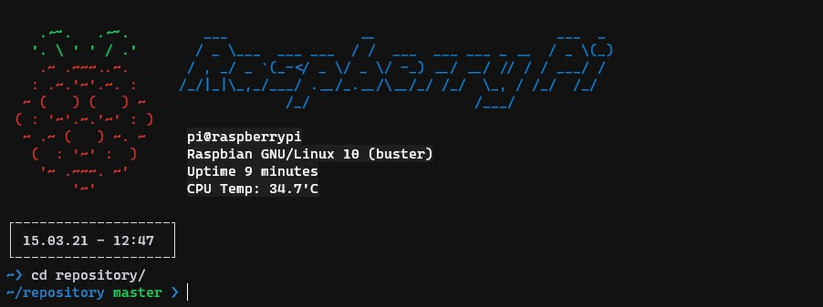

# Raspberry Pi install.sh
Here's my take on a 'install.sh' for fresh Raspberry Pi OS installations.

This comes with handy bash_aliases and a lightweight dynamic $PS1 bash prompt.

Known 'kind-of' Issue: Splash screen only shows a Raspberry on 32-bit Raspberry Pi OS

See also:
- [.bash_aliases](https://gist.github.com/lmzdev/41f545d9eb93c66d1ef72658ed7026c7)
- [.bash_prompt](https://gist.github.com/lmzdev/c03befd8b90a5851c1d96d78904ed39a)

and
- [update.sh](https://gist.github.com/lmzdev/21b683d4461f821107bced42a9d801fb)
- [rpi_backup.sh](https://gist.github.com/lmzdev/af788cb72631404cc49bafe84ab83c89)


## Usage
- Copy ```install.sh``` to Raspberry Pi, log in and run ```./install.sh```

----


